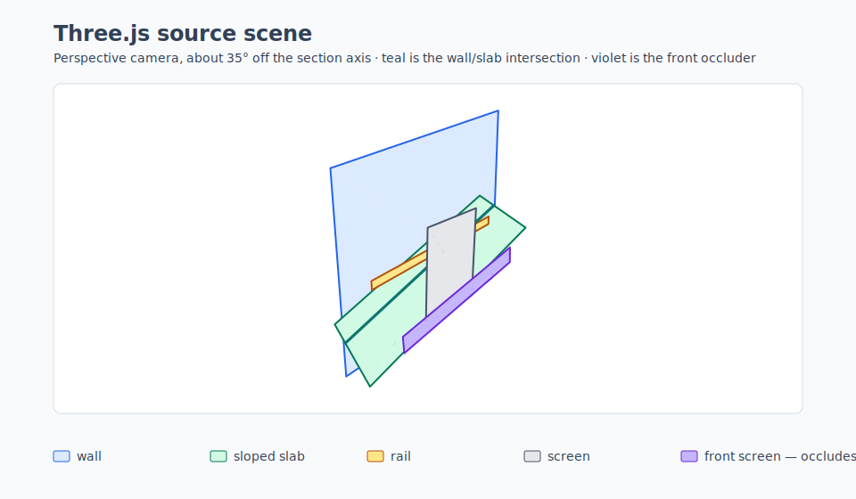
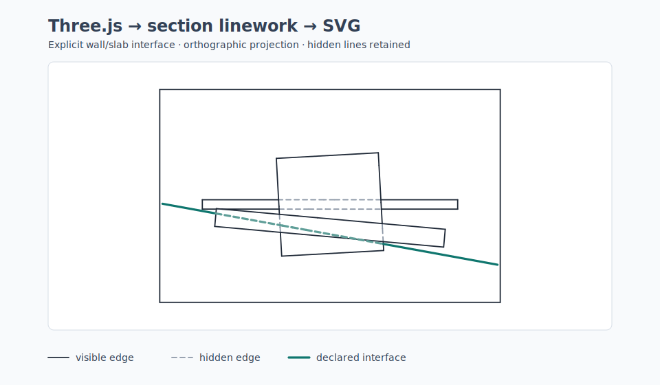

# Shared Section Rendering

Dependency-free TypeScript primitives for section projection, surface interfaces, and hidden-line linework. It projects geometry into an explicit drawing frame and classifies vector edge fragments as visible or hidden.

It deliberately does not generate cut solids, terrain masks, drawing sheets, labels, SVG layout, DXF layers, or Three.js objects. Those remain application responsibilities.

## Why this exists

This started as a vibe-coded shared extraction from a few personal projects. Each project had its own 3D model and drawing rules, but they repeatedly needed the same small piece of geometry work: select finite mesh geometry, project it into a section frame, retain hidden line fragments, and expose meaningful surface interfaces. The applications then turn that linework into their own SVG or DXF output.

It is useful when you are building a custom TypeScript tool and already own the domain model, section selection, and visual style. For example:

- A browser design tool uses Three.js geometry and needs a clean SVG section for a document or review image.
- An architectural or CAD-like tool needs to draw a declared wall/slab interface, rather than blindly intersect every mesh in the scene.
- A fabrication, spatial, or engineering tool needs deterministic visible/hidden vector linework before mapping it to its own SVG or DXF conventions.

It is not a complete CAD kernel or a general scene renderer. If you need solid cutting, Boolean topology, generic Three.js scene traversal, silhouettes, perspective rendering, or ready-made SVG/DXF documents, this package deliberately stops short of those concerns.

## Status

This is a source-first, pre-1.0 project. It is public on GitHub for review and reuse, but is intentionally not published to npm yet; `package.json` retains its publication guard. Automated tests, deterministic fixtures, and documented numerical limits support the current scope, but breaking API and numerical-contract changes may occur while the initial consumers establish the right boundary.

## API

```ts
import { classifyVisibility, createSectionFrame, projectMesh } from '@antti/section-rendering';

const frame = createSectionFrame({
  origin: { x: 0, y: 0, z: 0 },
  uAxis: { x: 1, y: 0, z: 0 },
  vAxis: { x: 0, y: 0, z: 1 },
  depthAxis: { x: 0, y: 1, z: 0 }
});
const projected = projectMesh(mesh, frame);
const fragments = classifyVisibility(projected.edges, projected.faces, {
  tolerances: { planar: 0.001, depth: 0.05 }
});
```

`SectionPoint` uses `u`, `v`, and `depth`; lower depth is closer to the viewer. Frames must be orthogonal. Each consumer supplies tolerances in its own unit system.

`intersectMeshes` extracts non-coplanar world-space interface segments between two meshes. Pass them through `projectWorldEdges` before adding them to `classifyVisibility`; point contact and positive-area coplanar overlap are available as diagnostics rather than generated linework. Interface extraction accepts triangles and convex, planar polygon faces; it rejects non-planar or concave input rather than silently changing its shape through fan triangulation.

## Three.js to SVG example

The checked-in example constructs transformed Three.js planes, explicitly selects one wall/slab interface, projects the resulting linework, classifies hidden fragments, and writes deterministic SVGs. It runs in Node from a source checkout: no WebGL canvas or browser is required.

```bash
# From a clone of this repository:
npm run render:three-section-demo
```

The source scene is first shown through an oblique Three.js `PerspectiveCamera`. The teal line is the actual computed wall/slab intersection. The long violet front screen hides portions of the other screen, wall, slab, and rail; it makes clear which geometry produces the section image.



The matching orthographic view retains hidden fragments as dashed linework and gives the explicitly declared wall/slab interface drawing priority over the coincident source boundary.



The Three.js conversion helper and the SVG camera preview live only in [`examples/three-section-svg`](./examples/three-section-svg). They are deliberately not package exports or package artifacts: callers still choose which mesh to convert, which pairs are meaningful interfaces, and how SVG is styled. The picture is orthographic section-style projection, not a cut-solid result.

## Numerical contract

All linear tolerances use the caller's model unit. `angular` / `angularTolerance` compare normalized directions, and `parameter` applies only to an edge's normalized `0..1` interval. Scale coordinates and linear tolerances together when changing units. Interface IDs derive from their source meshes, contributing faces, and tolerance-quantized endpoints, so they do not depend on output-array order.

## Development

```bash
npm install
npm run typecheck
npm test
npm run build
npm run pack:check
```

The checked-in SVG fixtures are for visual review only. The package has no SVG, Three.js, or DXF adapter in v0.1.

See [the rendering centralization plan](./docs/CENTRALIZATION_PLAN.md) for the intended adapter boundaries and extraction order.

## Limits in v0.1

This is a linework primitive library, not a complete CAD section engine. It does not cut a solid by a section plane, create caps, determine inside/outside, or perform Boolean operations; callers must supply the geometry they want to draw.

- Output is orthographic and opaque: there is no perspective, transparency, silhouette extraction, shading, viewport clipping, or line-style policy.
- It works on finite, faceted geometry. Curves, NURBS, implicit solids, instancing, and transformed Three.js `BufferGeometry` need a caller-side adapter or tessellation. The example contains one deliberately local conversion helper, not a supported adapter API.
- Visibility needs convex, depth-planar section faces. Interface extraction needs two distinct meshes with convex, planar faces; it does not support self-intersection or a multi-mesh contact graph.
- Coplanar mesh overlap is diagnostic-only. It produces neither overlap boundaries nor trimmed/Boolean topology.
- The algorithms use caller-owned tolerances and standard floating-point predicates. Very small slivers, near-coplanar geometry, and coordinates with extreme magnitude need application-specific tolerance selection and should be validated against representative models.
- Visibility uses tolerance-aware projected bounding boxes as an exact broad phase before its boundary and depth predicates. It is still intended for finite section geometry rather than general scene rendering; pre-filter or partition very large triangle meshes when appropriate.
